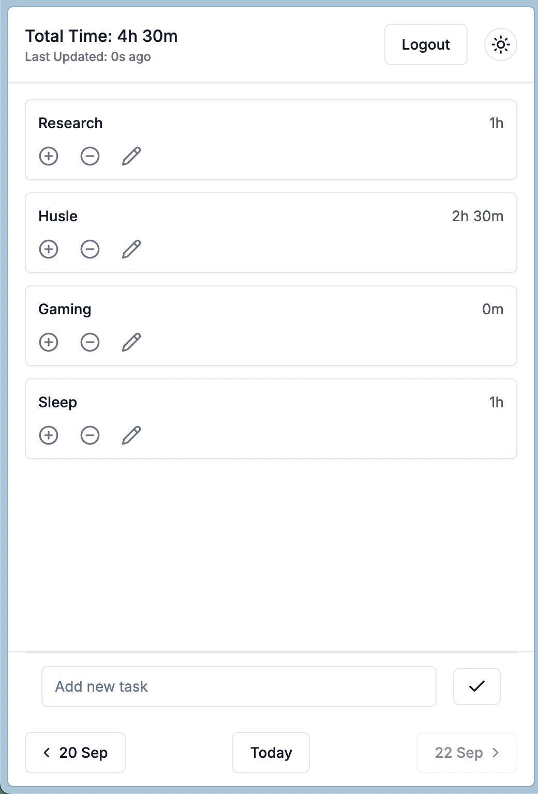

# Task Time Tracker Frontend
This project provides a minimalistic interface to manage tasks and track time on a daily basis.



## Requirements
- Node.js >= 18
- npm (or yarn/pnpm/bun)

## Installation
1. Create a `.env.local` file in the project root and set your backend API URL:
	```sh
	NEXT_PUBLIC_API_URL=http://localhost:8000/api
	```
2. Install dependencies:
	 ```sh
	 npm install
	 ```
3. Start the development server:
	 ```sh
	 npm run dev
	 ```
	 The app will be available at [http://localhost:3000](http://localhost:3000).

## Usage
- Main page: `src/app/page.tsx`
- UI components: `src/components/ui/`
- Global state/context: `src/contexts/`
- Helper utilities: `src/helpers/`, `src/lib/`
- Styling: Tailwind config in `tailwind.config.ts`, global styles in `src/app/globals.css`

## Developer Commands
- Build for production:
	```sh
	npm run build
	```
- Lint (if configured):`
	```sh
	npm run lint
	```

## Project Structure
- `src/app/` — Main app pages and layout
- `src/components/` — React components
- `src/components/ui/` — Atomic UI components
- `src/contexts/` — React context providers
- `src/helpers/`, `src/lib/` — Utility functions

## API Integration
- Communicates with the backend via REST endpoints (see backend API docs)
- Authentication context in `src/contexts/AuthContext.js` (matches backend Laravel Sanctum)

